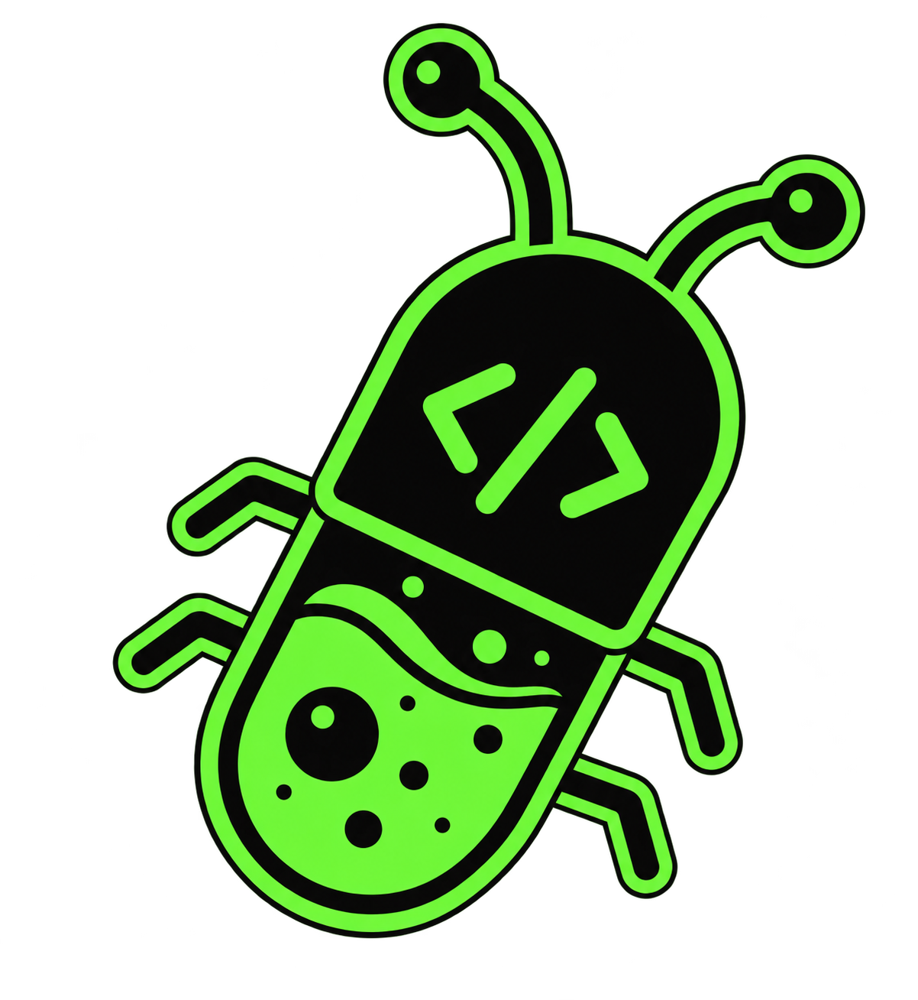

<p align="center">
  
</p>

<h1 align="center">Dr. Debug</h1>

<p align="center">
  <strong>Autonomous in-browser runtime diagnostics and root-cause analysis.</strong><br>
  An in-page diagnostic agent that intercepts runtime failures, correlates network with console errors, and prescribes verified code fixes.
</p>

<p align="center">
  <a href="#-why-dr-debug"></a>
  <a href="#-tests--health"></a>
  <a href="#-chrome-extension"></a>
  <a href="#-license"></a>
</p>

---

## 🔍 The Problem

Debugging modern web applications is fragmented:
1. An endpoint returns `503 Service Unavailable` or `CORS blocked`.
2. React crashes with an unhandled exception three frames later.
3. You manually copy the stack trace from the Console, switch to the Network tab to copy headers and payloads, and paste it all into an LLM chat window.
4. The LLM hallucinates because it lacks the runtime execution context.

**Dr. Debug lives directly inside the browser runtime.** When an anomaly happens, it inspects the telemetry, correlates network failures with console exceptions through a deterministic Re-Act loop, and outputs the root cause with a copy-pasteable unified code diff.

---

## ⚡ What It Does

* **🩺 Non-Blocking Telemetry Capture:** Intercepts `console.error`, unhandled rejections, `fetch`/`XHR` requests, and memory heap allocation in memory with zero page slowdown.
* **🧠 Autonomous Re-Act Diagnostic Engine:** Formulates hypotheses and executes step-by-step diagnostic tools (`inspect_error`, `inspect_request`, `eval_js`, `done`) until it reaches root cause verification.
* **🎨 Isolated Shadow DOM HUD:** Draggable, responsive frosted-glass cockpit encapsulated inside `#dr-debug-root` (zero CSS pollution or layout shifts).
* **🌐 Chrome Extension (Manifest V3):** Inject across any site or inspect through a dedicated Chrome DevTools Substrate tab with 1-click Markdown/JSON RCA export.
* **🔌 Pluggable LLM Providers:** Run locally via LiteRT / Chrome Built-in AI, or connect ultra-fast inference via Groq, Anthropic, or OpenAI.

---

## 🛠️ Architecture

Dr. Debug is built as a modular TypeScript monorepo:

```
DebugCopilot/
├── packages/
│   ├── controller/   # Multi-stream interceptors (Console, Fetch, XHR, Vitals, Heap)
│   ├── core/         # Re-Act reasoning loop, Reflection parser & Diagnostic tools
│   ├── ui/           # Shadow DOM HUD, Draggable Pill, Live Equalizer & Cockpit Drawer
│   ├── llms/         # LLM adapter interface (LiteRT local client, Groq, Claude, OpenAI)
│   ├── extension/    # Manifest V3 Chrome Extension & DevTools Substrate panel
│   └── dr-debug/     # Top-level orchestrator & standalone bundle
```

---

## 🚀 Quickstart

### Option A: Install as a Chrome Extension

1. Clone this repository and install dependencies:
   ```bash
   git clone https://github.com/your-username/DebugCopilot.git
   cd DebugCopilot
   npm install
   npm run build:extension
   ```
2. Open Google Chrome and navigate to `chrome://extensions`.
3. Enable **Developer mode** (top right toggle).
4. Click **Load unpacked** and select the `packages/extension` (or `packages/extension/dist`) directory.
5. Open any webpage — the Dr. Debug floating capsule will appear.

---

### Option B: Import into a JavaScript / TypeScript App

```bash
npm install dr-debug
```

Initialize inside your frontend entry point (`main.ts`, `index.tsx`, etc.):

```typescript
import { DrDebug } from 'dr-debug'

const debuggerInstance = new DrDebug({
  enableUI: true,            // Mount Shadow DOM floating HUD
  autoInvestigate: false,     // Launch RCA only on demand or error selection
  modelProvider: 'groq',      // 'groq' | 'litert' | 'anthropic' | 'openai'
  apiKey: process.env.GROQ_API_KEY
})
```

---

### Option C: Standalone `<script>` Tag

Include the pre-bundled standalone script before your application loads:

```html
<script src="https://unpkg.com/dr-debug/dist/dr-debug.min.js"></script>
<script>
  window.__DR_DEBUG__ = new DrDebug({
    enableUI: true
  });
</script>
```

---

## 🔬 Autonomous Re-Act Diagnostic Loop

When an investigation is triggered, Dr. Debug gathers raw runtime state into a structured `<debug_state>` XML snapshot and initiates a cyclical diagnostic loop:

```
                                  [ Runtime Telemetry ]
                              (Console + Network + Heap)
                                         │
                                         ▼
                             ┌───────────────────────┐
                             │  <debug_state> Parse  │
                             └───────────┬───────────┘
                                         │
                 ┌───────────────────────┴───────────────────────┐
                 ▼                                               ▼
     ┌───────────────────────┐                       ┌───────────────────────┐
     │  Hypothesis & Reason  │                       │   Tool Execution      │
     │  "503 caused by auth" │ ────> [ Re-Act ] ───> │  `inspect_request(0)` │
     └───────────────────────┘                       └───────────┬───────────┘
                 ▲                                               │
                 └────────────────── Output Data ────────────────┘
                                         │
                                         ▼ (Confidence Verified)
                             ┌───────────────────────┐
                             │  Root Cause Diagnosis │
                             │   + Unified Diff Fix  │
                             └───────────────────────┘
```

### Diagnostic Tools Registry
* `inspect_error`: Fetches parsed stack frames, source lines, and error metadata.
* `inspect_request`: Inspects headers, method, status, duration, and response body previews.
* `eval_js`: Safely tests expressions in the page context.
* `done`: Concludes investigation with finding, root cause, confidence score, and unified `.patch`.

---

## 🧪 Testing & Code Health

Dr. Debug enforces strict unit and integration test coverage across all packages:

```bash
npm test
```

```
 Test Files  14 passed (14)
      Tests  46 passed (46)
   Duration  ~3s
```

* Interceptor mutex re-entrancy protection (guards against React DevTools / Next.js ping-pong loops).
* Source map VLQ line/column mapping tests.
* Deterministic XML state serializer validation.
* Re-Act autonomous triage loop simulation tests.

---

## 📋 Roadmap

- [x] **Phase 1: Deep Substrate & XML Serializer** (Console, Network, Web Vitals, Memory).
- [x] **Phase 2: Autonomous Re-Act Diagnostic Engine** (Zod reflection parser, 9 tools).
- [x] **Phase 3: Shadow DOM Floating HUD** (Obsidian glassmorphism, live equalizer bars, draggable modal).
- [x] **Phase 4: Chrome Extension & DevTools Panel** (Manifest V3, source map demangling, Markdown/JSON RCA export).
- [ ] **Phase 5: Framework Hooks & 30s Session Replay** (React/Redux store inspection, PII-masked `rrweb` interaction recording).
- [ ] **Phase 6: Model Context Protocol (MCP) Server** (Direct IDE bridge to Cursor, Claude Code, and Antigravity).

---

## 📄 License

MIT © [Saswat / Dr. Debug Team](LICENSE)
