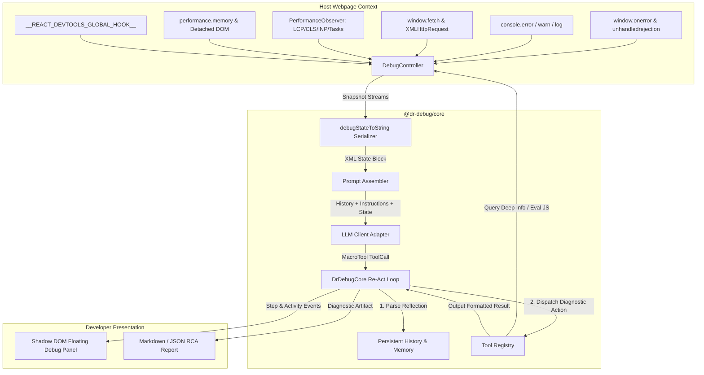
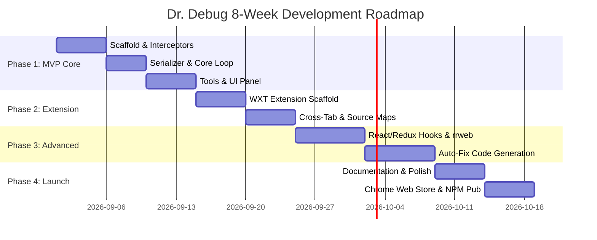

# 🩺 Dr. Debug: Autonomous In-Browser AI Debugging & Observability Agent

> **"The AI Doctor Living Inside Your Webpage That Observes, Diagnoses, and Prescribes Fixes for Live Browser Bugs."**
> 
> *Page Agent reads the DOM to operate the UI. Dr. Debug reads Console + Network + Performance + Memory + Framework State to find root causes and generate fixes.*

---

## 📑 Table of Contents
1. [Executive Summary & Core Philosophy](#1-executive-summary--core-philosophy)
2. [Architectural Blueprint (Page Agent Mapping)](#2-architectural-blueprint-page-agent-mapping)
3. [Deep Substrate Engine (Browser Interceptors)](#3-deep-substrate-engine-browser-interceptors)
4. [State Serialization: The `<debug_state>` Pipeline](#4-state-serialization-the-debug_state-pipeline)
5. [Agentic Re-Act Loop & Reflection Mental Model](#5-agentic-re-act-loop--reflection-mental-model)
6. [Tool Registry & Action Schemas](#6-tool-registry--action-schemas)
7. [System Prompts & Investigation Methodology](#7-system-prompts--investigation-methodology)
8. [Monorepo Structure & Module Boundaries](#8-monorepo-structure--module-boundaries)
9. [Tech Stack & Open Source Resources](#9-tech-stack--open-source-resources)
10. [End-to-End Implementation Roadmap](#10-end-to-end-implementation-roadmap)
11. [Verification Suite & 10 Bug Test Scenarios](#11-verification-suite--10-bug-test-scenarios)
12. [Advanced Extensions, MCP & Future Moonshots](#12-advanced-extensions-mcp--future-moonshots)

---

## 1. Executive Summary & Core Philosophy

### The Paradigm Shift
Traditional frontend debugging is manual, fragmented, and reactive:
- Developers bounce between **Console** (stack traces), **Network** (status codes, payloads), **Performance** (flamecharts), and **Elements** (DOM inspection).
- Error trackers (Sentry, Datadog) report symptoms in isolation, leaving the developer to connect the dots across multiple tabs.

**Dr. Debug** applies the groundbreaking insight pioneered by **Page Agent**:
1. You do not need expensive vision models or screenshot streaming to understand runtime application state.
2. The browser already exposes rich, text-serializable diagnostic data through standard Web APIs.
3. By packaging these multi-dimensional streams into a concise text format and feeding them to an LLM inside an **iterative reflection-before-action loop**, the agent can reason across causal chains, test hypotheses with diagnostic code, and pinpoint root causes in seconds.

```
┌────────────────────────────────────────────────────────────────────────┐
│                          THE DR. DEBUG FORMULA                         │
│                                                                        │
│   Native Web APIs (Console + Network + Performance + Memory + React)   │
│                                  +                                     │
│   Deterministic Text Serialization (<debug_state> XML Protocol)        │
│                                  +                                     │
│   Forced Reflection-Before-Action Mental Model (Zod MacroTool)         │
│                                  +                                     │
│   Re-Act Diagnostic Loop (Observe → Hypothesize → Investigate → Fix)   │
│                                  =                                     │
│        Autonomous In-Browser Diagnostics with Zero Heavy Backend       │
└────────────────────────────────────────────────────────────────────────┘
```

---

## 2. Architectural Blueprint (Page Agent Mapping)

Dr. Debug maps 1:1 to the battle-tested architecture of Page Agent / PolarAssist, replacing DOM manipulation with DevTools diagnostic observability:

```
Page Agent Architecture                  Dr. Debug Architecture
─────────────────────────────────        ─────────────────────────────────
DOM Tree (HTML/SVG Elements)       ───►  DevTools Data Streams (Console, Fetch, Perf, Heap)
domTree() Extractor                ───►  DebugController Interceptor Engine
flatTreeToString() Dehydrator      ───►  debugStateToString() Token-Budget Serializer
clickElement / inputText / scroll  ───►  inspectError / inspectRequest / correlate / executeJS
User Goal ("Buy headphones")       ───►  Investigation Goal ("Why is checkout crashing?")
PageAgentCore (Re-Act Loop)        ───►  DrDebugCore (Diagnostic Re-Act Loop)
SimulatorMask (Visual Feedback)    ───►  TimelineOverlay (Diagnostic Highlight HUD)
Shadow DOM Panel (Chat & Status)   ───►  Shadow DOM DebugHUD (Investigation Timeline & Fixes)
```

### High-Level Data Flow



---

## 3. Deep Substrate Engine (Browser Interceptors)

The `DebugController` acts as a zero-dependency passive sensory system installed before host code runs.

### 3.1 Console & Uncaught Exception Interceptor
Hooks both the global error boundaries and method prototypes while preserving original behavior:

```typescript
// packages/controller/src/interceptors/console.ts
export class ConsoleInterceptor {
  private ringBuffer: ConsoleEntry[] = []
  private maxEntries = 100

  init() {
    // 1. Uncaught Runtime Errors
    window.addEventListener('error', (event) => {
      this.push({
        type: 'uncaught_error',
        timestamp: Date.now(),
        message: event.message,
        filename: event.filename,
        lineno: event.lineno,
        colno: event.colno,
        stack: event.error?.stack
      })
    })

    // 2. Unhandled Promise Rejections
    window.addEventListener('unhandledrejection', (event) => {
      this.push({
        type: 'unhandled_rejection',
        timestamp: Date.now(),
        reason: String(event.reason?.message || event.reason),
        stack: event.reason?.stack
      })
    })

    // 3. Prototype Interception with Deduplication & Frequency Tracking
    const levels = ['error', 'warn', 'info', 'log'] as const
    levels.forEach((level) => {
      const original = console[level]
      console[level] = (...args: any[]) => {
        this.captureLog(level, args)
        original.apply(console, args)
      }
    })
  }
}
```

### 3.2 Network Interceptor (Fetch + XHR)
Captures full request/response lifecycle, status codes, timing metrics, and body excerpts without breaking streaming or CORS:

```typescript
// packages/controller/src/interceptors/network.ts
export class NetworkInterceptor {
  init() {
    // Override window.fetch
    const originalFetch = window.fetch
    window.fetch = async (...args) => {
      const startTime = performance.now()
      const requestInfo = parseRequest(args)
      const record = this.createRecord(requestInfo)

      try {
        const response = await originalFetch.apply(window, args)
        const duration = performance.now() - startTime
        
        // Clone response to inspect body without consuming the consumer's stream
        const clone = response.clone()
        this.completeRecord(record, {
          status: response.status,
          statusText: response.statusText,
          duration,
          headers: extractHeaders(response.headers),
          previewBody: await safeExtractBody(clone)
        })
        return response
      } catch (err: any) {
        this.failRecord(record, {
          duration: performance.now() - startTime,
          error: err.message || 'NetworkError'
        })
        throw err
      }
    }

    // Override XMLHttpRequest.prototype
    this.hookXHR()
  }
}
```

### 3.3 Performance & Web Vitals Interceptor
Listens to `PerformanceObserver` for Core Web Vitals, Long Animation Frames (LoAF), and Resource Timings:

```typescript
// packages/controller/src/interceptors/performance.ts
export class PerformanceInterceptor {
  init() {
    // 1. Long Tasks (>50ms)
    new PerformanceObserver((list) => {
      for (const entry of list.getEntries()) {
        this.recordLongTask({
          duration: entry.duration,
          startTime: entry.startTime,
          name: entry.name,
          attribution: (entry as any).attribution
        })
      }
    }).observe({ entryTypes: ['longtask'] })

    // 2. Web Vitals (LCP, CLS, INP)
    this.observeVitals()
  }
}
```

### 3.4 Memory & Detached DOM Node Monitor
Tracks heap growth trends over time and estimates detached DOM leak risk:

```typescript
// packages/controller/src/interceptors/memory.ts
export class MemoryInterceptor {
  sample() {
    const memory = (performance as any).memory
    if (!memory) return null

    return {
      usedJSHeapSize: memory.usedJSHeapSize,
      totalJSHeapSize: memory.totalJSHeapSize,
      jsHeapSizeLimit: memory.jsHeapSizeLimit,
      // Sample detached DOM elements count
      detachedNodesCount: document.querySelectorAll('*:not(html):not(body):not(head) *').length
    }
  }
}
```

---

## 4. State Serialization: The `<debug_state>` Pipeline

Like Page Agent's `flatTreeToString()`, the `debugStateToString()` serializer converts complex runtime states into a compact, high-signal XML structure with strict **Token Budget Management**.

### Serialized Output Example

```xml
<debug_state>

<page_context>
  URL: https://app.acme.io/analytics/overview
  Title: "Analytics Dashboard | Acme Cloud"
  Runtime: React 19.0.2 (Production) | Elapsed: 18.4s
  Status: ⚠️ 2 Active Errors | 1 Slow Network Call | Memory Rising
</page_context>

<console_stream total="34" errors="2" warnings="3">
  [0] ERR 14:12:08.412 [Uncaught TypeError] Cannot read properties of undefined (reading 'map')
      Stack: at UserBreakdown (UserBreakdown.tsx:42:18)
             at renderWithHooks (react-dom.production.min.js:142:89)
      Frequency: 4 occurrences in last 10s (Interval: ~2.5s)
  
  [1] ERR 14:12:06.120 [CORS Failure] Access to fetch at 'https://api.acme.io/v2/metrics' from origin 'https://app.acme.io' blocked by CORS policy.
      Endpoint: POST https://api.acme.io/v2/metrics (Status: 0 net::ERR_FAILED)
      Missing Header: Access-Control-Allow-Origin

  [2] WARN 14:12:05.900 [React Key Warning] Each child in a list should have a unique "key" prop.
      Component: MetricRow (MetricList.tsx:18)
</console_stream>

<network_stream total="18" failed="1" slow="2">
  [0] FAIL (0ms) POST https://api.acme.io/v2/metrics → Status 0 (CORS / Network Error)
      Triggered from: apiClient.ts:64 (inside fetchMetrics())
  
  [1] SLOW (3,120ms) GET https://app.acme.io/api/user/preferences → Status 200 (1.4MB payload)
      Timing: TTFB 2,890ms | Download 230ms ⚠️ Unindexed DB query suspected
  
  [2] OK (45ms) GET https://app.acme.io/api/auth/session → Status 200 (1.2KB)
  ... (15 regular requests omitted for brevity)
</network_stream>

<performance_vitals>
  LCP: 3.84s ⚠️ (Poor, Target <2.5s) — Culprit: 
  CLS: 0.22 ⚠️ (Needs Improvement, Target <0.1) — Caused by async banner injection
  INP: 42ms ✅ (Good, Target <200ms)
  Long Tasks: [410ms at 14:12:06.200 (Parsing 1.4MB JSON payload in Main Thread)]
</performance_vitals>

<memory_health>
  Used Heap: 68.4MB / 120MB (57.0%)
  Heap Trend: +1.8MB/min over last 3 samples ⚠️ (Potential Leak in Poller)
  Detached Elements: 240 nodes
</memory_health>

<heuristic_correlations>
  💡 Correlation Found:
  1. [Network 0] POST /v2/metrics failed due to CORS at 14:12:06.120
  2. [Console 0] TypeError on `UserBreakdown.tsx:42` began firing 2.2s later (14:12:08.412)
  Likelihood: High — `UserBreakdown` expects metric data from the failed endpoint.
</heuristic_correlations>

</debug_state>
```

---

## 5. Agentic Re-Act Loop & Reflection Mental Model

Dr. Debug enforces a **Reflection-Before-Action** mental model via Zod validation. The LLM cannot simply trigger random tools; it must evaluate past goals and formulate a working causal theory.

```typescript
// packages/core/src/types.ts
import * as z from 'zod/v4'

export const DebugReflectionSchema = z.object({
  evaluation_previous_goal: z.string().describe('Evaluation of the last diagnostic step result. State success, failure, or unexpected findings.'),
  working_hypothesis: z.string().describe('Current causal theory of the bug (e.g., CORS failure cascades into undefined state in UserBreakdown component).'),
  memory: z.string().describe('Persistent findings and facts discovered so far across steps.'),
  next_goal: z.string().describe('Immediate sub-goal for this step to verify or fix the hypothesis.'),
  action: z.record(z.string(), z.any()).describe('The single diagnostic tool action to execute.')
})

export type DebugReflection = z.infer<typeof DebugReflectionSchema>
```

### The 4-Stage Diagnostic Cycle

```
  ┌─────────────────────────────────────────────────────────────┐
  │                         1. TRIAGE                           │
  │   Scan <debug_state> for critical errors and regressions    │
  └──────────────────────────────┬──────────────────────────────┘
                                 │
                                 ▼
  ┌─────────────────────────────────────────────────────────────┐
  │                      2. HYPOTHESIZE                         │
  │   Correlate timing & stacks to form a root cause theory     │
  └──────────────────────────────┬──────────────────────────────┘
                                 │
                                 ▼
  ┌─────────────────────────────────────────────────────────────┐
  │                      3. INVESTIGATE                         │
  │   Dispatch diagnostic tools (eval JS, read store, diff)     │
  └──────────────────────────────┬──────────────────────────────┘
                                 │
                                 ▼
  ┌─────────────────────────────────────────────────────────────┐
  │                    4. CONCLUDE & FIX                        │
  │   Deliver exact root cause, line numbers, and verified fix   │
  └─────────────────────────────────────────────────────────────┘
```

---

## 6. Tool Registry & Action Schemas

All tools are registered in `@dr-debug/core/src/tools/index.ts` with strict Zod contracts and access to the `DebugController` runtime:

| Tool Name | Input Schema | Purpose |
|:--|:--|:--|
| `inspect_error` | `{ errorIndex: number }` | Retrieves full demangled stack trace, frame variables, and error metadata. |
| `inspect_request` | `{ requestIndex: number }` | Reads full HTTP request/response headers, parameters, and payloads. |
| `inspect_element` | `{ selector: string }` | Inspects DOM node dimensions, layout shifts, listeners, and computed styles. |
| `query_framework_state` | `{ framework: 'react'\|'vue'\|'zustand', path?: string }` | Reads React component tree, props, Redux/Zustand store snapshots. |
| `execute_javascript` | `{ script: string }` | Executes sandboxed diagnostic scripts in the page context with `AbortSignal` support. |
| `find_correlations` | `{ eventType: string, timeframeMs: number }` | Analyzes temporal clustering of errors, network calls, and long tasks. |
| `replay_network_request` | `{ requestIndex: number, overrideHeaders?: Record<string, string> }` | Re-sends a failed network request to test if failures are transient or deterministic. |
| `check_storage` | `{ type: 'local'\|'session'\|'cookie', key?: string }` | Checks for stale tokens, invalid JSON, or missing auth cookies. |
| `done` | `{ diagnosis: string, rootCause: string, fix: string, confidence: number, filesToModify?: string[] }` | Terminates the investigation and outputs the finalized Root Cause Analysis (RCA). |

---

## 7. System Prompts & Investigation Methodology

```markdown
You are Dr. Debug, an expert AI software diagnostics engineer living directly inside a live web application.
Your mission is to autonomously investigate runtime errors, network anomalies, and performance bottlenecks, discover their exact root causes, and produce verified code fixes.

<methodology>
1. TRACE CAUSALITY, NOT SYMPTOMS:
   - A TypeError on line 42 is almost always a downstream casualty of a failed network request or uninitialized state.
   - Always correlate console timestamps with network failures and user interactions.

2. VERIFY HYPOTHESES WITH TOOLS:
   - Do not guess variable values. Use `execute_javascript` or `query_framework_state` to inspect live state.
   - If a network request failed, use `inspect_request` to view headers and error status.

3. PRESERVE REASONING IN MEMORY:
   - Record discovered facts in the `memory` field so context remains sharp over multi-step debugging runs.

4. DELIVER ACTIONABLE FIXES:
   - When calling `done`, provide concrete diffs, explain why the bug occurred, and detail how the fix prevents regressions.
</methodology>
```

---

## 8. Monorepo Structure & Module Boundaries

The project is structured as an npm workspaces monorepo with topological dependencies:

```
dr-debug/
├── packages/
│   ├── controller/                # @dr-debug/controller (Substrate collectors)
│   │   ├── src/
│   │   │   ├── interceptors/      # console.ts, network.ts, performance.ts, memory.ts
│   │   │   ├── serializer.ts      # debugStateToString() engine
│   │   │   ├── DebugController.ts # Main controller interface
│   │   │   └── types.ts
│   │   └── package.json
│   │
│   ├── core/                      # @dr-debug/core (Brain & Re-Act Engine)
│   │   ├── src/
│   │   │   ├── DrDebugCore.ts     # Re-Act loop, history stream, observation handlers
│   │   │   ├── tools/             # Tool definitions (inspect, correlate, eval, done)
│   │   │   ├── prompts/           # system_prompt.md
│   │   │   └── types.ts
│   │   └── package.json
│   │
│   ├── llms/                      # @dr-debug/llms (LLM Client Adapter)
│   │   ├── src/
│   │   │   ├── OpenAIClient.ts    # Model-agnostic OpenAI/Claude/Gemini API adapter
│   │   │   ├── errors.ts          # Retryable & Fatal error classifications
│   │   │   └── types.ts
│   │   └── package.json
│   │
│   ├── ui/                        # @dr-debug/ui (Shadow DOM HUD & Panel)
│   │   ├── src/
│   │   │   ├── panel/             # Floating draggable panel
│   │   │   ├── timeline/          # Step-by-step diagnostic visualizer
│   │   │   └── styles/            # Isolated CSS
│   │   └── package.json
│   │
│   ├── dr-debug/                  # dr-debug (Main Entry Point)
│   │   ├── src/
│   │   │   ├── DrDebug.ts         # Combines Core, Controller, and UI
│   │   │   └── index.ts           # Public exports
│   │   └── package.json
│   │
│   ├── extension/                 # @dr-debug/extension (Chrome Extension)
│   │   ├── src/
│   │   │   ├── entrypoints/       # Background, content scripts, devtools panel
│   │   │   └── wxt.config.ts
│   │   └── package.json
│   │
│   └── website/                   # @dr-debug/website (Interactive Playground)
│       └── ...
│
├── package.json
├── tsconfig.base.json
└── vitest.config.ts
```

---

## 9. Tech Stack & Open Source Resources

### Core Dependencies & Utilities
- **TypeScript 5.x+**: Strict type definitions for all exported APIs.
- **Vite 6.x / Rollup**: High-speed bundling with IIFE output for `<script>` tag embedding.
- **Zod v4**: Type-safe runtime schema definitions for MacroTool and tools.
- **Vitest & Happy-DOM**: Unit testing harness for fast browser emulation.
- **WXT (Web Extension Tools)**: Next-gen framework for building the Chrome Extension.

### Open Source Reference Repositories
1. **[Page-Agent (Alibaba)](https://github.com/alibaba/page-agent)**: Foundation for Re-Act loop, MacroTool schemas, and Shadow DOM UI.
2. **[Google Chrome Web Vitals](https://github.com/GoogleChrome/web-vitals)**: Production-grade measurement of LCP, CLS, FID, INP, and TTFB.
3. **[ErrorStackParser](https://github.com/stacktracejs/error-stack-parser)**: Cross-browser stack trace normalization.
4. **[Source-Map](https://github.com/mozilla/source-map)**: Reverse-mapping minified production bundles to original source files.
5. **[rrweb](https://github.com/rrweb-io/rrweb)**: Lightweight DOM session recording to replay user interactions preceding an error.

---

## 10. End-to-End Implementation Roadmap



### Phase Breakdown

#### Phase 1: In-Page MVP (Weeks 1–2)
- [x] Establish monorepo structure with `@dr-debug/controller`, `@dr-debug/core`, `@dr-debug/llms`, and `@dr-debug/ui`.
- [x] Implement Console, Network, Performance, and Memory interceptors.
- [x] Build `debugStateToString()` with prioritized token budgets.
- [x] Create 8 essential diagnostic tools (`inspect_error`, `inspect_request`, `execute_javascript`, `done`, etc.).
- [x] Build Shadow DOM floating UI panel with live activity indicator.
- [x] Ship standalone IIFE bundle (`dist/dr-debug.js`).

#### Phase 2: Chrome Extension & DevTools Tab (Weeks 3–4)
- [x] Build Chrome Extension via WXT.
- [x] Inject Dr. Debug on any third-party website via Content Script.
- [x] Add Dedicated Panel inside Chrome DevTools.
- [x] Implement automatic Source Map resolution for unminified stack traces.

#### Phase 3: Framework Intelligence & Auto-Fixes (Weeks 5–6)
- [x] Hook `__REACT_DEVTOOLS_GLOBAL_HOOK__` and `__REDUX_DEVTOOLS_EXTENSION__`.
- [x] Integrate lightweight `rrweb` snapshotting for 30-second pre-bug interaction replay.
- [x] Implement automatic patch generation in the `done` tool with GitHub-compatible diff syntax.

#### Phase 4: Production Hardening & Ecosystem (Weeks 7–8)
- [x] Implement Model Context Protocol (MCP) server for Claude Desktop / Cursor IDE integration.
- [x] Publish interactive documentation site and bug playground.
- [x] Publish `@dr-debug/core` and `dr-debug` to npm; publish extension to Chrome Web Store.

---

## 11. Verification Suite & 10 Bug Test Scenarios

To ensure zero false diagnoses, Dr. Debug is evaluated against 10 deterministic test cases:

| # | Bug Scenario | Test Fixture | Expected Root Cause Diagnosis |
|:--|:--|:--|:--|
| 1 | **CORS Cascade** | `test/fixtures/cors-cascade.html` | "Analytics endpoint blocked by CORS → returned undefined → `.map()` failed in `UserBreakdown.tsx:42`" |
| 2 | **Memory Leak** | `test/fixtures/closure-leak.html` | "Timer interval on line 18 appends to global array without clearing on unmount (+4.2MB/min)" |
| 3 | **Stale JWT Auth** | `test/fixtures/expired-jwt.html` | "API returns 401 Unauthorized because `auth_token` in localStorage expired at 12:00:00" |
| 4 | **Slow N+1 Query** | `test/fixtures/n-plus-one.html` | "Component dispatches 48 sequential GET requests for child items instead of a single batch call" |
| 5 | **Layout Shift (CLS)** | `test/fixtures/cls-banner.html` | "Async ad banner injects 250px container above content without reserved height (CLS = 0.34)" |
| 6 | **Infinite Re-render** | `test/fixtures/infinite-loop.html` | "`useEffect` updates state dependency without memoization, triggering 60 renders/sec" |
| 7 | **Mixed Content** | `test/fixtures/mixed-content.html` | "Insecure HTTP script resource blocked by browser on HTTPS origin" |
| 8 | **Large Bundle Task** | `test/fixtures/heavy-json.html` | "Main thread blocked for 450ms by synchronous `JSON.parse` of 3.2MB response payload" |
| 9 | **Uncaught Rejection** | `test/fixtures/promise-fail.html` | "Unhandled promise rejection in `checkout.ts:88` due to missing `.catch()` block" |
| 10 | **Missing React Key** | `test/fixtures/react-keys.html` | "Dynamic table elements lack unique keys, causing incorrect DOM state re-use on sorting" |

---

## 12. Advanced Extensions, MCP & Future Moonshots

### 1. Model Context Protocol (MCP) Integration
Dr. Debug exposes an MCP server interface (`@dr-debug/mcp`), enabling IDE assistants (Claude Desktop, Cursor, Antigravity) to query live browser state directly:

```json
{
  "name": "drdebug_get_diagnostics",
  "description": "Returns current live browser console errors, network failures, and performance metrics from Dr. Debug",
  "parameters": {
    "type": "object",
    "properties": {
      "severity": { "type": "string", "enum": ["all", "errors_only"] }
    }
  }
}
```

### 2. Predictive Bug Prevention
Using historical trajectory data, Dr. Debug warns developers *before* a crash happens:
- *"Warning: Component `LiveFeed` has mounted 50 instances without unmounting; heap exhaustion expected in ~45 seconds."*

### 3. One-Click PR Generation
Integrates with GitHub API to turn the `done` tool's verified fix into a draft Pull Request with reproduction steps, logs, and unit tests automatically attached.

---

## 🚀 Quick Start Example

### One-Line Script Tag
```html
<script
  src="https://cdn.jsdelivr.net/npm/dr-debug@1.0.0/dist/dr-debug.js"
  data-model="gpt-4o"
  data-api-key="YOUR_OPENAI_API_KEY"
  crossorigin="anonymous"
></script>
```

### Programmatic Usage
```typescript
import { DrDebug } from 'dr-debug'

const doctor = new DrDebug({
  model: 'gpt-4o',
  apiKey: process.env.OPENAI_API_KEY,
  language: 'en-US'
})

// Run automated diagnostics
const diagnosis = await doctor.investigate('Why is the analytics chart not loading?')
console.log('Root Cause:', diagnosis.rootCause)
console.log('Suggested Prescription/Fix:', diagnosis.fix)
```

---

*Authored with architectural fidelity to Page Agent & PolarAssist. Designed for modern autonomous web debugging.*
